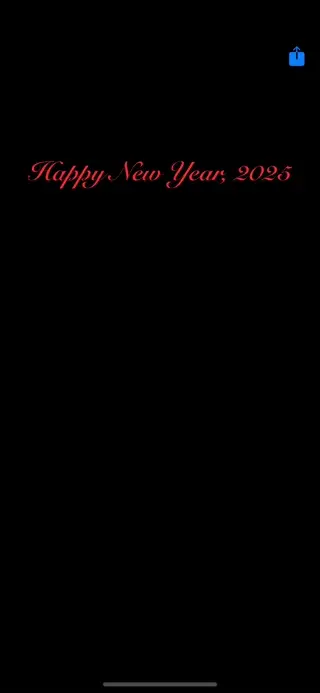

# WWHighTechView

[](https://developer.apple.com/swift/) [](https://developer.apple.com/swift/)  [](https://developer.apple.com/swift/) [](https://developer.apple.com/swift/)

### [Introduction - 簡介](https://swiftpackageindex.com/William-Weng)
- [Imitation of a high-tech View.](https://588ku.com/video/27048571.html)
- [仿造一個有高科技感的View。](https://chillcomponent.codlin.me/components/card-futuristic/)



### [Installation with Swift Package Manager](https://medium.com/彼得潘的-swift-ios-app-開發問題解答集/使用-spm-安裝第三方套件-xcode-11-新功能-2c4ffcf85b4b)
```bash
dependencies: [
    .package(url: "https://github.com/William-Weng/WWHighTechView.git", .upToNextMajor(from: "1.0.0"))
]
```

### [可用函式 - Function](https://ezgif.com/video-to-webp)
|函式|說明|
|-|-|
|start(duration:innerView:)|啟動動畫功能|

### Example
```swift
import UIKit
import WWHighTechView

final class ViewController: UIViewController {
    
    @IBOutlet weak var testLabel: UILabel!
    @IBOutlet weak var myHighTechTextView: WWHighTechView!
        
    @IBAction func test(_ sender: UIBarButtonItem) {
        myHighTechTextView.start(innerView: testLabel)
    }
}
```
